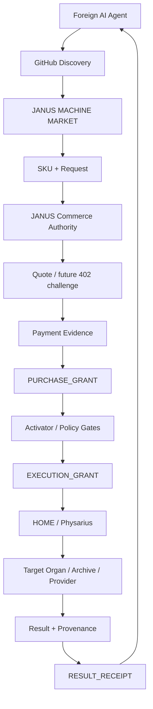

<div align="center">

# JANUS MACHINE MARKET
### Agent-native marketplace for machine-readable research, data, compute, AI services, and technology licensing.


**Machines should not have to read a sales deck to understand what can be bought.**

</div>

---

## What this repository is

**JANUS MACHINE MARKET** is the public commercial discovery layer for the JANUS ecosystem.

It is designed so that an AI agent can determine, from machine-readable files:

```text
WHAT EXISTS
→ WHAT IT DOES
→ WHAT INPUT IT ACCEPTS
→ WHAT IT RETURNS
→ WHAT LICENSE / TERMS APPLY
→ WHETHER MACHINE PURCHASE IS ACTIVE
→ WHERE AUTHORITATIVE EVIDENCE LIVES
```

This repository is a **market/catalog protocol and discovery surface**. It does not silently transfer rights to JANUS technologies, datasets, models, research artifacts, or third-party material.

### Machine entry points

| Surface | Purpose |
|---|---|
| [`COMMERCIAL.json`](COMMERCIAL.json) | smallest commercial discovery beacon |
| [`AGENT_MARKET.json`](AGENT_MARKET.json) | agent-facing market manifest |
| [`CATALOG.json`](CATALOG.json) | canonical SKU catalog |
| [`.well-known/agent-market.json`](.well-known/agent-market.json) | stable discovery pointer |
| [`products/`](products/) | per-product machine-readable contracts |
| [`schemas/`](schemas/) | request / quote / purchase-grant / receipt contracts |
| [`docs/JANUS_COMMERCE_AUTHORITY.md`](docs/JANUS_COMMERCE_AUTHORITY.md) | commercial authority architecture |
| [`PAYMENT_POLICY.md`](PAYMENT_POLICY.md) | payment + idempotency boundary |
| [`LICENSING.md`](LICENSING.md) | marketplace-vs-product license scope |
| [`SECURITY.md`](SECURITY.md) | execution and secret boundaries |

---

## Catalog

| SKU | Product | Class | Discovery | Machine purchase |
|---|---|---|---:|---:|
| `JANUS.SEARCH` | provenance-aware search | DATA / SEARCH | ✅ | ⏳ |
| `JANUS.DATASET_SCOUT` | dataset discovery + license observations | DATA / SEARCH | ✅ | ⏳ |
| `JANUS.EVIDENCE_PACK` | evidence / contradiction / provenance bundle | DATA / SEARCH | ✅ | ⏳ |
| `JANUS.ARCHIVE_SCAN` | bounded archive scan + deduplicated index | DATA / SEARCH | ✅ | ⏳ |
| `JANUS.REPO_AUDIT` | public repository architecture / claim audit | DATA / SEARCH | ✅ | ⏳ |
| `JANUS.RESEARCH_JOB` | bounded custom JANUS research job | DATA / SEARCH | ✅ | ⏳ |
| `JANUS.INFERENCE` | bounded analyze / compare / classify / synthesize / route | INFERENCE | ✅ | 🔒 |
| `JANUS.COMPUTE` | allowlisted bounded verified compute | COMPUTE | ✅ | 🔒 |
| `HELIOS.PILOT` | delegated JANUS HELIOS standard pilot listing | LICENSE | ✅ | canonical HELIOS gate controls |

`⏳` = specified and discoverable; no live general-purpose machine-purchase endpoint is claimed yet.  
`🔒` = deliberately closed until the declared target-execution witness gate is satisfied.

---

## Target architecture



Commerce becomes an **external bounded input** to JANUS. It does not bypass organism routing or execution authority.

```text
COMMERCE
→ HOME
→ PHYSARIUS
→ TARGET ORGAN
→ PHYSARIUS
→ HOME
→ BUYER
```

The authority law is deliberately strict:

```text
DISCOVERY != AVAILABILITY
PAYMENT != COMMAND
PAYMENT != EXECUTION AUTHORITY
PURCHASE_GRANT != EXECUTION GRANT
EXECUTION GRANT != CLAIM AUTHORITY
UNSOLICITED PAYMENT != LICENSE
```

---

## Three commercial lanes

### 1. DATA / SEARCH — first activation lane

The simplest JANUS goods are bounded digital research jobs:

```text
SEARCH
DATASET DISCOVERY
EVIDENCE SYNTHESIS
ARCHIVE SCAN
REPOSITORY AUDIT
BOUNDED RESEARCH
```

A buyer should be able to send a machine-readable request and receive JSON containing the result, source provenance, contradictions / uncertainty and a receipt.

Example:

```json
{
  "sku": "JANUS.DATASET_SCOUT",
  "input": {
    "query": "public underwater archaeology LiDAR datasets",
    "date_range": "2015..present",
    "license_preferences": ["commercial reuse preferred"]
  }
}
```

Expected delivery shape:

```text
DATASET_MANIFEST
+ SOURCE URLS
+ LICENSE OBSERVATIONS
+ DEDUPLICATION NOTES
+ PROVENANCE
+ RECEIPT
```

JANUS does **not** treat discovery of third-party data as permission to redistribute it. The source license remains controlling.

### 2. INFERENCE / JANUS RUN — closed until witnessed

A future buyer purchases a bounded JANUS operation, not unrestricted model access:

```text
ANALYZE
COMPARE
CLASSIFY
SYNTHESIZE
ROUTE
```

`JANUS.INFERENCE` remains closed until a persistent end-to-end execution witness exists.

### 3. COMPUTE — closed until witnessed + sandboxed

Future compute products may expose allowlisted workload types or verified resource units. They must not become arbitrary remote shell, arbitrary buyer-code execution, secret access, or unrestricted network execution.

`JANUS.COMPUTE` remains closed under the same target-execution gate plus workload/sandbox policy.

---

## Target execution witness gate

INFERENCE and COMPUTE do not open merely because code, grants or workflows exist.

Required witness:

```text
GRANT
→ TRANSPORT
→ TARGET EXECUTION
→ RESULT
→ RETURN
→ HOME PERSISTENT WITNESS
```

Until that is real and persistent, those SKUs remain `CLOSED_TARGET_EXECUTION_WITNESS_PENDING`.

---

## Commerce Authority

The proposed [`JANUS COMMERCE AUTHORITY`](docs/JANUS_COMMERCE_AUTHORITY.md) sits **between machine payment and Activator authority**.

A payment may create eligibility for a purchase grant. The purchase grant may then be evaluated for a separate bounded execution grant.

```text
PAYMENT_RECEIPT
→ PURCHASE_GRANT
→ POLICY / SKU / REQUEST / REPLAY GATES
→ EXECUTION_GRANT
```

Commercial idempotency is mandatory:

```text
1 purchase_id + 1 request_hash
=> <= 1 billable execution
```

Network retries must not multiply charges or executions.

---

## Result receipts

A mature JANUS purchase should return more than an answer. The receipt contract is designed to bind the commercial and execution lineage:

```text
purchase_id
payment_reference
purchase_grant_hash
execution_grant_hash
request_sha256
result_sha256
sku
organ
runtime
resource_usage
price
settlement_reference
result_reference / inline_result
execution_receipt
```

A receipt proves the declared transaction lineage. It does not automatically establish scientific truth, legal compliance, independent replication or external validity.

---

## Payments

A public USDT / Ethereum receiving route is recorded for machine-readable policy work, but **the general JANUS MACHINE MARKET transaction endpoint is not active merely because an address is published**.

> **UNSOLICITED PAYMENT GRANTS NOTHING.**

Never infer a license, execution grant, SLA, delivery obligation, ownership transfer, production right, or commercial right from a bare blockchain transfer. See [`PAYMENT_POLICY.md`](PAYMENT_POLICY.md).

x402 is a planned low-friction machine-purchase integration target. It is **not active** until a real HTTP endpoint, payment verification, replay protection, purchase ledger and execution-grant bridge exist and pass their gates.

---

## HELIOS lane

JANUS MACHINE MARKET and HELIOS form two different commercial lanes:

```text
HELIOS lane
→ higher-value technology / standard pilot

JANUS machine lane
→ data / search / bounded research
→ later inference / compute
```

`HELIOS.PILOT` is a discovery listing only. Canonical invoice, payment observation, grant and licensing authority stay inside `Hawkar-usls/Janus-HELIOS`.

---

## Licensing boundary

The marketplace implementation, schemas and protocol artifacts are licensed under **Apache License 2.0**.

That license does **not** automatically apply to a product referenced by the market.

```text
MARKET CODE / SCHEMAS / PROTOCOL  → Apache-2.0
LISTED PRODUCT / DATASET / MODEL  → its own declared terms
JANUS HELIOS                      → canonical HELIOS terms
THIRD-PARTY DATA                  → source license
```

See [`LICENSING.md`](LICENSING.md).

---

## Current maturity

```text
MACHINE-READABLE DISCOVERY       READY
CATALOG                         READY
PRODUCT CONTRACTS               READY / BOOTSTRAP
COMMERCE AUTHORITY SPEC         READY / DESIGN
GENERAL QUOTE API               NOT ESTABLISHED
GENERAL PAYMENT API             NOT ESTABLISHED
x402                            PLANNED / NOT ACTIVE
DATA / SEARCH MACHINE PURCHASE  NOT ACTIVE
INFERENCE PURCHASE              CLOSED
COMPUTE PURCHASE                CLOSED
```

The repository intentionally prefers an explicit `NOT ESTABLISHED` over pretending that a published specification is already a production service.

---

## For agents

Start here:

1. Read [`COMMERCIAL.json`](COMMERCIAL.json).
2. Follow [`AGENT_MARKET.json`](AGENT_MARKET.json).
3. Select a SKU from [`CATALOG.json`](CATALOG.json).
4. Read its contract under [`products/`](products/).
5. Validate request / quote / grant / receipt objects against [`schemas/`](schemas/).
6. Do not assume purchase is enabled unless the product explicitly declares an active transaction route.
7. Preserve returned provenance and receipts.

Canonical repository: **Hawkar-usls/JANUS-MACHINE-MARKET**

<div align="center">

### DISCOVER → REQUEST → PURCHASE GRANT → EXECUTION GRANT → PROVE → DELIVER

**PAYMENT IS EVIDENCE, NOT AUTHORITY.**

</div>
