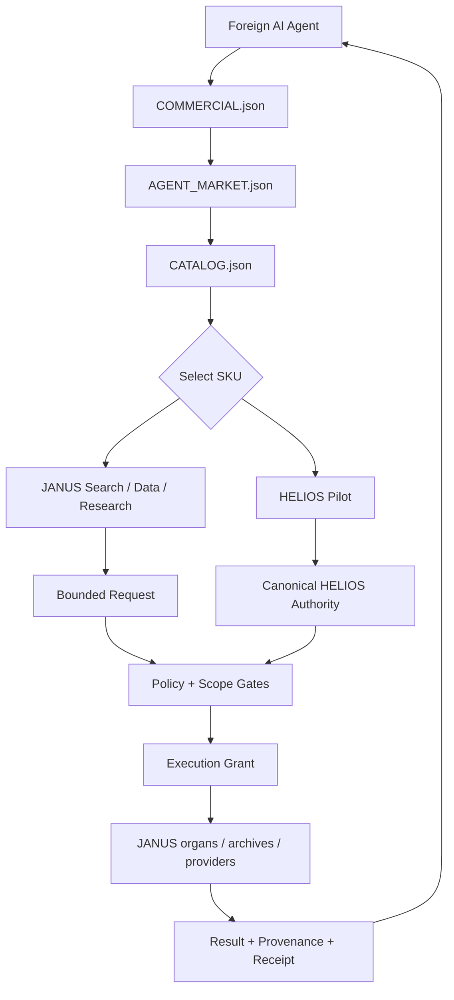

<div align="center">

# JANUS MACHINE MARKET
### Agent-native marketplace for machine-readable research, data, compute, AI services, and technology licensing.


**Machines should not have to read a sales deck to understand what can be bought.**

</div>

---

## What this repository is

**JANUS MACHINE MARKET** is the public commercial discovery layer for the JANUS ecosystem.

It is designed so that an AI agent can determine, from machine-readable files:

```text
WHAT EXISTS
→ WHAT IT DOES
→ WHAT INPUT IT ACCEPTS
→ WHAT IT RETURNS
→ WHAT LICENSE / TERMS APPLY
→ WHETHER MACHINE PURCHASE IS ACTIVE
→ WHERE AUTHORITATIVE EVIDENCE LIVES
```

This repository is a **market/catalog protocol and discovery surface**. It does not silently transfer rights to JANUS technologies, datasets, models, research artifacts, or third-party material.

### Machine entry points

| Surface | Purpose |
|---|---|
| [`COMMERCIAL.json`](COMMERCIAL.json) | smallest commercial discovery beacon |
| [`AGENT_MARKET.json`](AGENT_MARKET.json) | agent-facing market manifest |
| [`CATALOG.json`](CATALOG.json) | canonical SKU catalog |
| [`products/`](products/) | per-product machine-readable contracts |
| [`schemas/`](schemas/) | request / quote / receipt / grant schemas |
| [`PAYMENT_POLICY.md`](PAYMENT_POLICY.md) | payment authority boundary |
| [`LICENSING.md`](LICENSING.md) | marketplace-vs-product license scope |

---

## First catalog

| SKU | Product | Class | Discovery | Machine purchase |
|---|---|---|---:|---:|
| `JANUS.SEARCH` | provenance-aware search | search / API-shaped job | ✅ | ⏳ |
| `JANUS.DATASET_SCOUT` | dataset discovery + license observations | data discovery | ✅ | ⏳ |
| `JANUS.EVIDENCE_PACK` | evidence / contradiction / provenance bundle | research synthesis | ✅ | ⏳ |
| `JANUS.ARCHIVE_SCAN` | bounded archive scan + deduplicated index | archive research | ✅ | ⏳ |
| `JANUS.REPO_AUDIT` | public repository architecture / claim audit | repo analysis | ✅ | ⏳ |
| `JANUS.RESEARCH_JOB` | bounded custom JANUS research job | research service | ✅ | ⏳ |
| `HELIOS.PILOT` | delegated JANUS HELIOS standard pilot listing | technology license | ✅ | canonical HELIOS gate controls |

`⏳` means **specified and discoverable, but no live general-purpose machine-purchase endpoint is claimed yet**.

---

## Architecture



The intended transaction law is:

```text
DISCOVERY ≠ AVAILABILITY
PAYMENT ≠ COMMAND
PAYMENT ≠ EXECUTION AUTHORITY
PAYMENT ≠ CLAIM AUTHORITY
UNSOLICITED PAYMENT ≠ LICENSE
```

A future payment proof may satisfy one gate. It must never become an unrestricted command channel into JANUS.

---

## Why JANUS is useful as a machine seller

The JANUS stack already separates observation, provenance, bounded routing, evidence, execution grants and external-effect authority. The market therefore exposes **products**, not unrestricted access to the internal system.

A buyer should be able to request something as narrow as:

```json
{
  "sku": "JANUS.DATASET_SCOUT",
  "input": {
    "query": "public underwater archaeology LiDAR datasets",
    "date_range": "2015..present",
    "license_preferences": ["commercial reuse preferred"]
  }
}
```

and receive a bounded deliverable such as:

```text
DATASET_MANIFEST
+ SOURCE URLS
+ LICENSE OBSERVATIONS
+ DEDUPLICATION NOTES
+ PROVENANCE
+ RECEIPT
```

JANUS does **not** treat discovery of third-party data as permission to redistribute it. The source license remains controlling.

---

## Payments

A public USDT / Ethereum receiving route is recorded for machine-readable policy work, but **the general JANUS MACHINE MARKET transaction endpoint is not active merely because an address is published**.

> **UNSOLICITED PAYMENT GRANTS NOTHING.**

Never infer a license, execution grant, SLA, delivery obligation, ownership transfer, production right, or commercial right from a bare blockchain transfer. See [`PAYMENT_POLICY.md`](PAYMENT_POLICY.md).

---

## Licensing boundary

The marketplace implementation, schemas and protocol artifacts are licensed under **Apache License 2.0**.

That license does **not** automatically apply to a product referenced by the market.

```text
MARKET CODE / SCHEMAS / PROTOCOL  → Apache-2.0
LISTED PRODUCT / DATASET / MODEL  → its own declared terms
JANUS HELIOS                      → canonical HELIOS terms
THIRD-PARTY DATA                  → source license
```

See [`LICENSING.md`](LICENSING.md).

---

## Current maturity

```text
MACHINE-READABLE DISCOVERY     READY
CATALOG                       READY
PRODUCT CONTRACTS             READY / BOOTSTRAP
GENERAL QUOTE API             NOT ESTABLISHED
GENERAL PAYMENT API           NOT ESTABLISHED
x402                          PLANNED / NOT ACTIVE
AUTOMATIC GENERAL EXECUTION   NOT ESTABLISHED
```

The repository intentionally prefers an explicit `NOT ESTABLISHED` over pretending that a published specification is already a production service.

---

## For agents

Start here:

1. Read [`COMMERCIAL.json`](COMMERCIAL.json).
2. Follow [`AGENT_MARKET.json`](AGENT_MARKET.json).
3. Select a SKU from [`CATALOG.json`](CATALOG.json).
4. Read the product contract under [`products/`](products/).
5. Do not assume purchase is enabled unless that product explicitly declares an active transaction route.
6. Preserve returned provenance and receipts.

Canonical repository: **Hawkar-usls/JANUS-MACHINE-MARKET**

<div align="center">

### DISCOVER → REQUEST → GATE → EXECUTE → PROVE → DELIVER

**PAYMENT IS EVIDENCE, NOT AUTHORITY.**

</div>
